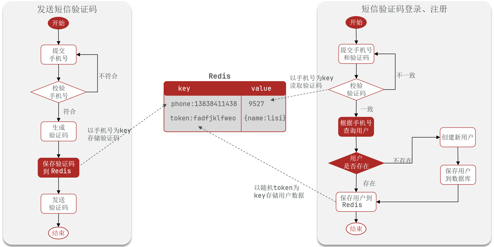
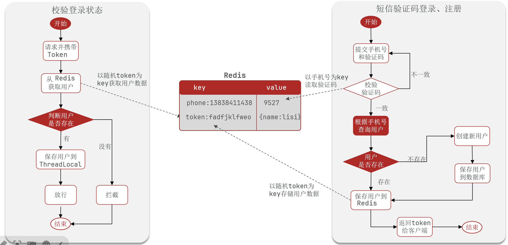

# 基于Redis实现共享session登录





## 设计要点

### 1. 保存验证码到Redis中，为什么使用 `phone`作为key？

短信验证码登录、注册的第一步是提交手机号和验证码。如果使用 `phone`作为key，可以直接从Redis中取出，无需做任何修改。

### 2. 保存用户到Redis中时，为什么使用 `token`而不是 `phone`？

由于登录验证的方式从session和cookies改为了Redis，所以前端需要携带 `token`返回。如果 `token`是手机号，则存在隐私泄露的风险。

### 3. 短信验证码登录/注册最后要返回 `token`到客户端？

- 登录凭证是令牌（`token`）本身。
- 后端验证时会对这个 `token` 做解析和校验，确认其合法性和有效期。
- 所以基于令牌登录需要返回登录凭证，因为整个过程不是自动的。

```java
public Result login(LoginFormDTO loginFormDTO, HttpSession session) {
        // 1. 校验手机号
        if (RegexUtils.isPhoneInvalid(loginFormDTO.getPhone())) {
            // 如果不符合，返回错误信息
            return Result.fail("手机号格式错误！");
        }
        // 2. 校验验证码
        // 从Redis中获取验证码并校验
        String cacheCode = stringRedisTemplate.opsForValue()
                .get(RedisConstants.LOGIN_CODE_KEY + loginFormDTO.getPhone())
                .replaceAll("\\x00\\x00", ""); // 删除Redis中乱码字段
        String code = loginFormDTO.getCode();

        if (!cacheCode.equals(code)) {
            // 3. 不一致，报错
            return Result.fail("验证码错误！");
        }

        // 4. 一致，在数据库中根据手机号查询用户
        // select * from tb_user where phone = ?
        User user = query().eq("phone", loginFormDTO.getPhone()).one(); // 使用MyBatisPlus

        // 5. 判断用户是否存在
        if (user == null) {
            // 6. 不存在，创建新用户并保存
            user = createUserWithPhone(loginFormDTO.getPhone());
        }

        // 7. 保存用户信息到Redis中
        // 7.1 随机生成token，作为登录令牌
        String token = UUID.randomUUID().toString(true);
        // 7.2 将User对象转换为HashMap存储
        UserDTO userDTO = BeanUtil.copyProperties(user, UserDTO.class);
        Map<String, Object> userMap = BeanUtil.beanToMap(userDTO, new HashMap<>(),
                CopyOptions.create()
                        .setIgnoreNullValue(true) // 忽略null值
                        .setFieldValueEditor((fieldName, fieldValue) ->
                                fieldValue.toString())); // 将String转为Long，否则id的类型对不上
        // 7.3 存储
        String tokenKey = RedisConstants.LOGIN_USER_KEY + token;
        stringRedisTemplate.opsForHash().putAll(tokenKey, userMap);
        // 7.4 设置token有效期
        stringRedisTemplate.expire(tokenKey, Duration.ofDays(RedisConstants.LOGIN_USER_TTL));

        // 8. 返回token
        return Result.ok(token);
    }
```

对于7.2，有一种简单的手动填充 `HashMap`的方法：

```java
// @Data
// public class UserDTO {
//     private Long id;
//     private String nickName;
//     private String icon;
//}

// 因为userDTO的字段并不多，所以可以直接手动装配userDTO的所有字段
Map<String, String> userMap = new HashMap<>();
userMap.put("id", String.valueOf(userDTO.getId()));
userMap.put("nickName", userDTO.getNickName());
userMap.put("icon", userDTO.getIcon());
```