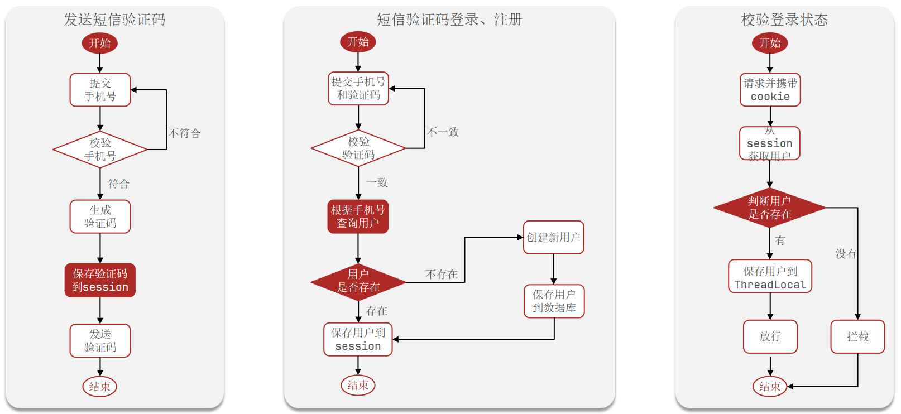
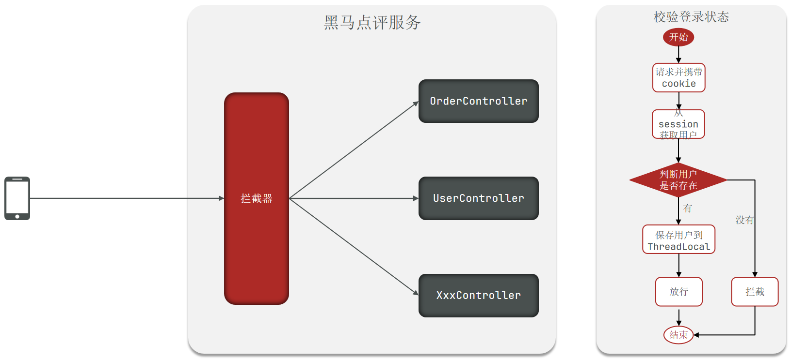

# 基于Session实现登录


## 1. 基于session登录的原理

当用户在服务器上被成功验证后，服务器会创建并保存一份“会话信息”（Session），同时给用户返回一个“会话标识”（通常是一个随机生成的字符串，存放在 Cookie 中）。在后续的每一次请求中，客户端会携带这个标识，服务器通过这个标识在其 Session 存储中找到对应的 Session，从而识别用户身份。

### 为什么基于session登录不用返回登录凭证？

- **Session + Cookie**：
    - 登录凭证是 **服务器端存储的 Session**，对客户端而言，只需要一个 **Session ID**（通常通过 Cookie 传递）。
    - 浏览器在后续请求时会自动携带这个 Cookie（其中包含 Session ID）。服务器通过这个 Session ID 来查找 Session 中的用户信息，从而知道用户已登录。
- **Token（比如 JWT）**：
    - 登录凭证是 **JWT 字符串** 本身。
    - 后端验证时会对这个 Token 做解析和校验，确认其合法性和有效期。
    - 所以基于JWT登录需要返回登录凭证，因为整个过程不是自动的。

## 2. 拦截器与`ThreadLocal`


### 2.1. 拦截器
#### 2.1.1. 拦截器的概念

- **拦截器**是框架级的功能，允许你在“请求进入控制器（Controller）”之前、之后、以及**请求完成**（视图渲染后）这几个阶段插入自定义逻辑。
- 在 Spring MVC 中，常见做法是实现 `HandlerInterceptor` 接口；在其他框架里如 Struts、Netty、JFinal 等，也有类似机制，只是名字或接口不一样。

拦截器对请求进行**集中式的预处理或收尾工作**，例如：

1. **权限验证**：在请求达到真正的业务逻辑前，先检查用户是否已登录、是否有访问权限。
2. **日志记录**：统计请求耗时、记录请求信息或参数等。
3. **国际化/编码处理**：对请求进行语言或字符编码的预处理。
4. **Session 或 Token 解析**：从请求里解析出用户凭证，加载用户信息等。

#### 2.1.2. Spring MVC 拦截器的生命周期

以 Spring MVC 为例，`HandlerInterceptor` 接口主要有三个方法（Spring 5.3 及以下版本；Spring 6 版本有些包结构调整，但原理一致）：

1. `preHandle(HttpServletRequest request, HttpServletResponse response, Object handler)`
    - 在调用目标 `Controller` 方法前执行。
    - 如果返回 `true`，继续后续流程；返回 `false` 则中断请求（常用于权限不足时的拦截）。
2. `postHandle(HttpServletRequest request, HttpServletResponse response, Object handler, ModelAndView modelAndView)`
    - 在请求执行完 `Controller` 方法后，但**还未渲染视图**时执行，可对 `ModelAndView` 做一些修改或处理。
3. `afterCompletion(HttpServletRequest request, HttpServletResponse response, Object handler, Exception ex)`
    - 在整个请求结束后执行（视图渲染完毕）。
    - 常用于**清理资源**或记录一些日志信息。如果在 `Controller` 或 `Interceptor` 中抛出异常，这里也会被执行，可以做异常处理或收尾工作。

### 2.2. `ThreadLocal`
`ThreadLocal` 是 Java 提供的一种用于在线程内部存储数据的机制。它可以让我们把某些变量的副本与当前线程绑定起来，使得同一个 `ThreadLocal` 变量在不同线程中有各自独立的副本，并且各个线程之间的副本互不影响、互不可见。
#### 2.2.1. 基本原理

- **普通变量共享性**：

  在多线程环境下，如果多个线程同时访问或修改某个普通对象的同一个引用，就可能出现线程安全问题，需要锁来保证数据一致性。

- **ThreadLocal 的独立性**：

  通过 `ThreadLocal` 维护的变量可以为每个线程保存一份“独立副本”，线程之间互不干扰。

    - 当你调用 `threadLocal.get()` 时，实际上是获取“当前线程”对应的那一份数据。
    - 当你调用 `threadLocal.set(value)` 时，实际上是为“当前线程”设置它自己的那一份数据。
- **存储结构**：

  在 JDK 实现中，每个 `Thread` 内部都有一个 `ThreadLocalMap`，它以 `ThreadLocal` 实例为 key、以真正的数据对象为 value。

    - `ThreadLocalMap` 是一个存在于线程内部的专有映射，不同线程有自己的 `ThreadLocalMap`。
    - 当线程被回收时，该线程对应的 `ThreadLocalMap` 也会被回收。


#### 2.2.2. 典型使用场景

1. **数据库连接/事务管理**：

   在一次请求的处理过程中，每个线程可能会使用自己的数据库连接。例如在 Spring 或 MyBatis 框架中，通常会用 `ThreadLocal` 来保存当前线程所使用的数据库连接或 Session 对象，避免在多线程环境下混用连接。

2. **Session 用户信息传递**：

   在 web 应用中，每个请求对应一个线程，我们可以把用户信息（比如 userId、role 等）放到 `ThreadLocal` 中，方便在中间件或业务逻辑的各层随时获取当前用户，而不必通过参数层层传递。

3. **格式化工具**：

   对于一些非线程安全的工具类（如 `SimpleDateFormat` 在旧版 Java 中是线程不安全的），我们可以为每个线程都创建一个独立的工具实例，存放在 `ThreadLocal` 中，避免多线程竞争导致错误。


#### 2.2.3. 常用方法

1. **创建 ThreadLocal 实例**

    ```java
    private static final ThreadLocal<String> threadLocal = new ThreadLocal<>();
    ```

   或者使用 JDK 8 提供的 `withInitial`：

    ```java
    private static final ThreadLocal<String> threadLocal = ThreadLocal.withInitial(() -> "DefaultValue");
    ```

2. **set()：为当前线程设置变量**

    ```java
    threadLocal.set("Hello");
    ```

3. **get()：获取当前线程变量**

    ```java
    String value = threadLocal.get();
    ```

4. **remove()：手动清除**

    ```java
    threadLocal.remove();
    ```

    - 通常建议在使用完 `ThreadLocal` 后调用 `remove()`，避免线程池复用线程时导致“脏数据”残留问题，也有助于垃圾回收。


#### 2.2.4. 常见问题与注意事项

1. **内存泄漏风险**：
    - 如果不手动执行 `remove()`，且 `ThreadLocal` 的 key 被回收，但对应的 value 还留在 `ThreadLocalMap` 中，就可能导致 value 无法被 GC 回收，从而造成内存泄漏。
    - 在使用线程池时，更要注意这个问题。线程池中的线程不会马上结束，而是被重复复用，`ThreadLocal` 里的数据也会一直存在。
2. **适用场景**：
    - `ThreadLocal` 更适合在无锁或减少锁的场景下，将共享变量变为各线程的独立副本，以减少并发访问问题。
    - 但要注意它只是在同一个线程内“共享”数据，而不是在不同线程之间共享；也不一定适合所有并发场景。
3. **仅在同一个线程中存取**：
    - 不要认为 `ThreadLocal` 是一个跨线程传递数据的工具。它只能保证在“当前线程”可见，无法让其他线程访问到该副本。
4. **对线程池的影响**：
    - 在使用线程池时，由于线程不会立即结束，线程内部的 `ThreadLocalMap` 也不会被自动销毁，数据如果不及时清理，就会一直滞留。


#### 2.2.5. 使用 `ThreadLocal` 存放当前用户信息

```java
public class UserContext {
    private static final ThreadLocal<User> userHolder = new ThreadLocal<>();

    public static void setUser(User user) {
        userHolder.set(user);
    }

    public static User getUser() {
        return userHolder.get();
    }

    public static void clear() {
        userHolder.remove();
    }
}

// 在某个拦截器或过滤器中，设置 ThreadLocal
public class LoginInterceptor implements HandlerInterceptor {
    @Override
    public boolean preHandle(HttpServletRequest request, HttpServletResponse response, Object handler)
            throws Exception {
        // 假设从token或session里取到用户对象
        User user = ...;
        UserContext.setUser(user);
        return true;
    }

    @Override
    public void afterCompletion(HttpServletRequest request, HttpServletResponse response, Object handler, Exception ex)
            throws Exception {
        // 请求结束后清理
        UserContext.clear();
    }
}

// 在业务逻辑中随时获取
public class SomeService {
    public void doSomething() {
        User currentUser = UserContext.getUser();
        // ...
    }
}
```

- 上述示例中，在拦截器的 `preHandle` 方法里给 `ThreadLocal` 存入当前用户信息，后续在同一个请求线程中可以直接通过 `UserContext.getUser()` 获取，无需多次传参。
- 最后在 `afterCompletion` 中调用 `clear()` 做清理。


#### 2.2.6. 总结

- **`ThreadLocal` 的作用**：将数据与线程绑定，使得每个线程拥有各自独立的数据副本，适合存放线程独享的变量，减少共享变量的锁竞争或并发访问问题。
- **使用注意**：一定要记得在合适的时机（如请求结束或任务完成）调用 `remove()`，防止出现数据泄漏，尤其在使用线程池或长生命周期线程的情况下。
- **只适用于单线程上下文**：`ThreadLocal` 并不能实现线程间通信或数据共享，它只是简化了在同一线程内传递数据的方式。


## 3. 拦截器与 `ThreadLocal`的关系

在 Web 应用（尤其是基于 Spring MVC 等框架）中，“拦截器（Interceptor）”是一种**横切关注点**（Cross-Cutting Concern）的实现手段，主要用来对请求进行**前置处理**、**后置处理**或**最终处理**。而 `ThreadLocal` 则可以帮助我们将数据与当前线程绑定，从而在拦截器或业务逻辑中更方便地获取一些上下文数据（比如当前登录用户的信息）。以下分成两部分讲解。

### 3.1. 使用 `ThreadLocal` 保存/获取当前用户信息的典型流程

1. **拦截器前置处理（`preHandle`）**
    - 从请求头、Cookie、Session 或 Token 中解析用户标识。
    - 查询数据库或缓存，得到用户对象（或最少信息，如 `userId` 、`role`）。
    - 通过 `ThreadLocal` 将该用户信息存储到当前线程的上下文中。
2. **Controller 或 Service 中获取用户信息**
    - 在业务逻辑的任何地方，只要在同一个线程内，就可以通过 `ThreadLocal.get()` 获取到当前用户信息，免去了传参的麻烦。
3. **拦截器后置处理（`afterCompletion`）**
    - 在请求结束时，调用 `ThreadLocal.remove()` 清除数据，防止出现“线程复用”导致的数据残留或内存泄漏问题。

### 3.2. 实际代码示例

以下是一个基于 Spring MVC `HandlerInterceptor` 的简化示例，展示了如何在 `preHandle` 中解析用户并存放到 `ThreadLocal`，以及在 `afterCompletion` 中进行清理。

```java
public class LoginInterceptor implements HandlerInterceptor {
    @Override
    public boolean preHandle(HttpServletRequest request, HttpServletResponse response, Object handler) throws Exception {
        // 1. 获取session
        HttpSession session = request.getSession();

        // 2. 获取session中的用户
        Object user = session.getAttribute("user");

        // 3. 判断用户是否存在
        if (user == null) {
            // 4. 不存在，拦截，返回401
            response.setStatus(HttpServletResponse.SC_UNAUTHORIZED);
        }

        // 5. 存在，保存用户信息到ThreadLocal
        UserHolder.saveUser((UserDTO) user);

        // 6. 放行
        return true;
    }

    @Override
    public void afterCompletion(HttpServletRequest request, HttpServletResponse response, Object handler, Exception ex) throws Exception {
        // 销毁用户信息
        UserHolder.removeUser();
    }
}
```

## 4. 集群的session共享问题

多台Tomcat并不共享session存储空间，一旦nginx的负载均衡调用另一个Tomcat服务器时，另一个Tomcat服务器不会存有原先Tomcat服务器的用户session，造成数据丢失的问题。session的替代方案应该满足：数据共享，内存存储、key-value结构，所以使用Redis集群。