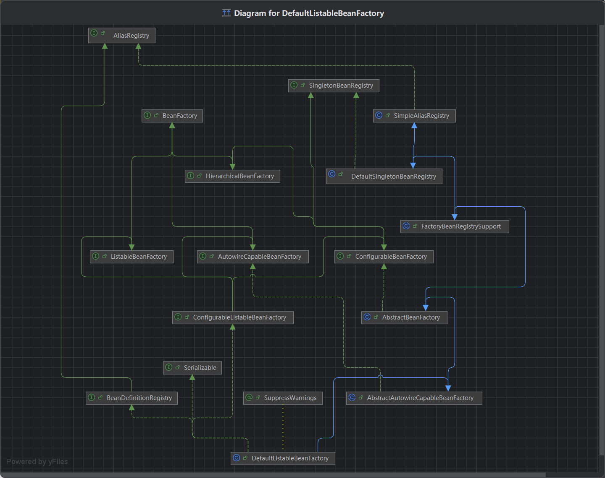
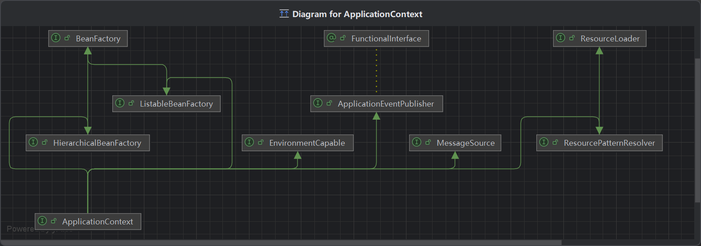
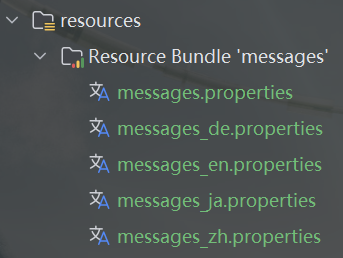

# 容器接口

>**本笔记基于黑马程序员 Spring高级源码解读**
>
> 更美观清晰的版本在：[**Github**](https://github.com/Emil-Stampfly-He/basics)

## 1. `ApplicationContext`组合`BeanFactory`的功能
`BeanFactory`是`ApplicationContext`的父接口，是Spring的核心容器。主要的`ApplicationContext`实现都是**组合**了它的功能。
这说明`BeanFactory`实际上是`ApplicationContext`的一个成员变量。

假设我们有如下启动类：
```java
@SpringBootApplication
@Slf4j
public class ContextApplication {
    public static void main(String[] args) {
        ConfigurableApplicationContext context = SpringApplication.run(ContextApplication.class, args);
        System.out.println(context);
    }
}
```
如果在`System.out.println(context);`处加断点采用debug模式运行，可以看到`context`有一个`beanFactory`的字段，其中包含了`singletonObject`，也就是用来存储单例bean的集合。
我们也可以从`getBean`这个方法看出这一点：
```java
// AbstractApplicationContext.java
@Override
public Object getBean(String name) throws BeansException {
    assertBeanFactoryActive();
    return getBeanFactory().getBean(name);
}
```
当我们在容器中获取一个bean的时候，首先要获取一个`beanFactory`，再调用`beanFactory`的`getBean`方法。这就是为什么说`ApplicationContext`组合了`BeanFactory`的功能。

## 2. `DefaultListableBeanFactory`
我们点开`BeanFactory`的源码，会发现基本只有围绕`getBean`的方法，似乎看不出什么门道。实际上，关于IOC, DI直到bean的生命周期的各种功能，都是由它的实现类提供的。其中最重要的便是`DefaultListableBeanFactory`。
这个类实现的接口非常多，`BeanFactory`只是它实现了的接口的其中一个。


让我们先看看`DefaultListableBeanFactory`是如何管理单例对象的。它的父类`DefaultSingletonBeanRegistry`提供了这些方法与字段：
```java
public class DefaultSingletonBeanRegistry extends SimpleAliasRegistry implements SingletonBeanRegistry {
    /*...*/
    private final Map<String, Object> singletonObjects = new ConcurrentHashMap<>(256);
    /*...*/
}
```
我们可以通过反射拿到这个字段来观察一下：
```java
public static void main(String[] args) throws NoSuchFieldException, IllegalAccessException {
    ConfigurableApplicationContext context = SpringApplication.run(ContextApplication.class, args);
    Field singletonObjects = DefaultSingletonBeanRegistry.class.getDeclaredField("singletonObjects");
    singletonObjects.setAccessible(true);
    ConfigurableListableBeanFactory beanFactory = context.getBeanFactory();
    Map<String, Object> map = (Map<String, Object>) singletonObjects.get(beanFactory);
    map.forEach((k, v) -> System.out.println(k + " = " + v));
}
```
打印出来后会发现Spring Boot已经给我们默认注入了很多的bean。

## 3. `ApplicationContext`扩展`BeanFactory`的功能
`ApplicationContext`不仅组合了`BeanFactory`的功能，还通过继承其他接口扩展了`BeanFactory`的功能：
* `MessageSource`
* `ResourcePatternResolver`
* `ApplicationEventPublisher`
* `EnvironmentCapable`


## 3.1. `MessageSource`
`MessageSource`代表处理国际化资源的能力，即支持多种语言的能力，类似于翻译。假设我们在`resources`下有这些`.properties`文件：



除了默认语言的文件`messages.properties`，其他每个文件都写上`hi=xxx`（`xxx`使用各国不同的语言的“你好”）：
```aiignore
hi=你好（Hello / こんにちは / Guten Tag）
```
我们就可以使用容器和键`hi`来获取到不同版本的值：
```java
System.out.println(context.getMessage("hi", null, Locale.CHINA));
System.out.println(context.getMessage("hi", null, Locale.US));
System.out.println(context.getMessage("hi", null, Locale.JAPAN));
System.out.println(context.getMessage("hi", null, Locale.GERMANY));
```
在实际应用中，地区的信息会从浏览器中的请求头中传递过来。

## 3.2. `ResourcePatternResolver`
`ResourcePatternResolver`代表基于通配符匹配资源的能力。“资源”即从类路径或磁盘路径找到的文件。我们在使用Spring Boot的时候经常要使用配置文件`.properties`或者`.yaml`文件，那么就可以使用这个类提供的`getResources`/`getResource`来获得该资源：
```java
Resource[] resources = context.getResources("classpath:application.properties");
for (Resource resource : resources) {System.out.println(resource);}
```
其中，`classpath`表示从类路径寻找，`file`表示从磁盘路径寻找。输出后可以看到我们的`application.properties`文件的类路径：
```aiignore
class path resource [application.properties]
```
也可以使用`getResources`来加载Spring Boot的`META-INF`文件：
```java
Resource[] resources = context.getResources("classpath*:META-INF/spring.factories");
for (Resource resource : resources) {System.out.println(resource);}
```
注意，由于Spring Boot的`META-INF`文件存在于`jar`包中，我们需要在`classpath`后加一个`*`代表从`jar`包中寻找。
```aiignore
URL [jar:file:/D:/Develop/Maven-3.8.8/mvn_repo/org/springframework/boot/spring-boot/3.4.4/spring-boot-3.4.4.jar!/META-INF/spring.factories]
URL [jar:file:/D:/Develop/Maven-3.8.8/mvn_repo/org/springframework/boot/spring-boot-autoconfigure/3.4.4/spring-boot-autoconfigure-3.4.4.jar!/META-INF/spring.factories]
URL [jar:file:/D:/Develop/Maven-3.8.8/mvn_repo/org/springframework/spring-aop/6.1.18/spring-aop-6.1.18.jar!/META-INF/spring.factories]
```
打印结果说明找到了3个相关的`META-INF`配置资源文件。

## 3.3.`ApplicationEventPublisher`
`ApplicationEventPublisher`代表发布`ApplicationEvent`的发布器，用来发布Spring中的事件，即`ApplicationEvent`。

我们可以这样定义事件：
```java
public class UserRegisteredEvent extends ApplicationEvent {
    public UserRegisteredEvent(Object source) {super(source);}
}
```
然后就可以发送一个事件了，发送事件的源头是`context`自己：

```java
context.publishEvent(new UserRegisteredEvent(context));
```
有了发送事件的，还必须要有接收事件的，也就是“监听器”。Spring中任何一个组件都可以成为监听器，例如我们定义一个`Component1`：

```java
@Component
@Slf4j
public class Component1 {
    @Async
    @EventListener
    public void listen(UserRegisteredEvent event) {log.info("Event: {}", event);}
}
```
这个监听器方法在收到事件之后会打印一条`DEBUG`信息。另外，加上`@Async`注解可以让接收事件异步进行（需要在启动类上加`@EnableAsync`注解，否则`@Async`注解会被忽略）。运行之后，我们可以看到控制台显示监听器接收到了消息并做出了回应：
```aiignore
2025-05-09T14:48:05.271+01:00  INFO 11112 --- [         task-7] spring.bean.Component1                   : Event: spring.bean.UserRegisteredEvent[source=org.springframework.boot.web.servlet.context.AnnotationConfigServletWebServerApplicationContext@1c33c17b, started on Fri May 09 14:48:03 BST 2025]
```

### EX. Spring中事件有什么用？
Spring的事件是一种解耦的体现。假设有一个类`UserRegistration`是用于做用户注册功能的：

```java
@Component
public class UserRegistration {
    public void register() {
        log.info("用户注册");
        /*用户注册逻辑*/
    }
}
```

假设第一个项目中我们希望用户注册完毕后给用户发送一个短信，第二个项目希望用户注册完毕后给用户发送一条邮件，而这种简单的功能又不值得我们再引入一个第三方的消息队列组件，那么我们就可以使用Spring中自带的事件机制。
为了使得代码可扩展，我们可以再`register`方法后加上一个发布事件的逻辑：

```java
@Component
public class UserRegistration {
    @Autowired
    private ApplicationEventPublisher publisher;

    public void register() {
        log.info("用户注册");
        /*用户注册逻辑*/
        // 消息来源是自己，所以填this
        publisher.publishEvent(new UserRegisteredEvent(this));
    }
}
```
那么我们就可以再定义其他多个`Component`类来处理这个事件，不管是发送短信还是发送邮件。这样就实现了注册和发送消息业务的解耦，可扩展性非常强。当然，这种解耦同样可以使用Spring AOP来实现，这里不再赘述。

## 3.4. `EnvironmentCapable`
* `EnvironmentCapable`代表获取环境配置信息的能力，例如读取环境变量、`.yaml`文件等。

```java
System.out.println(context.getEnvironment().getProperty("java_home"));
System.out.println(context.getEnvironment().getProperty("server.port"));
```
第一行很显然会打印JDK所在磁盘路径。注意这里的大小写是不敏感的，所以我们可以使用小写的`JAVA_HOME`。对于第二行如果我们在`application.properties`文件中设置了`server.port=8080`，那么第二行会打印`8080`。
