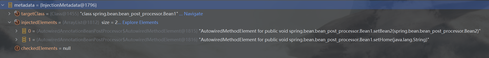

# 详解`@Autowired`的Bean后处理器

我们已经知道，解析`@Autowired`注解的Bean后处理器是`AutowiredAnnotationBeanPostProcessor`。这节便围绕这个Bean后处理器展开。

## 1.
我们先准备好以下代码。先创建一个`beanFasctory`，再向这个`beanFactory`中注册两个Bean：
````java
public class DigInAutowired {
    public static void main(String[] args) throws Throwable {
        DefaultListableBeanFactory beanFactory = new DefaultListableBeanFactory();
        beanFactory.registerSingleton("bean2", new Bean2()); // 直接注入了一个成品Bean，跳过了创建过程、依赖注入和初始化
        beanFactory.registerSingleton("bean3", new Bean3());
        beanFactory.setAutowireCandidateResolver(new ContextAnnotationAutowireCandidateResolver()); // @Value
    }
}
````
这里为了方便直接使用了`registerSingle`方法。相比于`registerBeanDefinition`，这个方法要简单得多，不需要再设置`BeanDefinition`。不过缺点是传入的对象会被默认为是一个成品Bean，也就是说`new Bean2()`这个`Bean2`不会经历创建到初始化的过程，而直接被当成是一个初始化完毕了的Bean来使用。
除此之外我们还给`beanFactory`设置了一个解析器。这个解析前面我们已经知道是用来解析`@Value`的。

现在我们来一步一步查看`AutowiredAnnotationBeanPostProcessor`到底是怎么工作的。我们首先将这个Bean后处理器创建出来，并设置它的`beanFactory`字段：
```java
public class DigInAutowired {
    public static void main(String[] args) throws Throwable {
        DefaultListableBeanFactory beanFactory = new DefaultListableBeanFactory();
        beanFactory.registerSingleton("bean2", new Bean2()); // 直接注入了一个成品Bean，跳过了创建过程、依赖注入和初始化
        beanFactory.registerSingleton("bean3", new Bean3());
        beanFactory.setAutowireCandidateResolver(new ContextAnnotationAutowireCandidateResolver()); // @Value

        // 1. 查找哪些字段、方法加了@Autowired
        AutowiredAnnotationBeanPostProcessor beanPostProcessor = new AutowiredAnnotationBeanPostProcessor();
        beanPostProcessor.setBeanFactory(beanFactory);
    }
}
```
为什么Bean后处理器中会有`beanFactory`的字段呢？当Bean后处理器在解析注解并进行Bean的依赖注入前，它先要获取到Bean的定义，而这存在于`beanFacory`中，所以它需要整体获取到`beanFactory`。

接下来我们创建一个`Bean1`对象并打印这个对象。很显然这个`bean1`的字段目前都是`null`，因为它还不是一个Bean：
```java
Bean1 bean1 = new Bean1();
System.out.println(bean1); // bean1字段全是null

// 在Bean1中重写toString方法
public class Bean1 {
    /*...*/
    @Override
    public String toString() {
        return "Bean1 [home=" + home + ", bean2=" + bean2 + "], bean3=" + bean3 + "]";
    }
}
```
要想让`bean1`的字段有值，我们需要将它交给这个`beanPostProcessor`进行处理，`postProcessProperties`这一方法可以满足我们的需要。
第一个字段不重要，我们填入`null`，而第二和第三个字段则分别指代Bean和Bean的名字：
```java
beanPostProcessor.postProcessProperties(null, bean1, "bean1"); // 执行依赖注入@Autowired @Value
System.out.println(bean1); // bean1字段有值
```
我们可以在输出结果中看到`bean1`的字段已经被赋上了值（`bean3`仍然为`null`，这是可以理解的，因为我们还没有加入处理`@Resource`的Bean后处理器）。

`postProcessProperties`方法内部是如何工作的？我们跟进源码：
```java
// AutowiredAnnotationBeanPostProcessor.java
@Override
public PropertyValues postProcessProperties(PropertyValues pvs, Object bean, String beanName) {
    InjectionMetadata metadata = findAutowiringMetadata(beanName, bean.getClass(), pvs);
    try {
        metadata.inject(bean, beanName, pvs);
    }
    catch (BeanCreationException ex) {
        throw ex;
    }
    catch (Throwable ex) {
        throw new BeanCreationException(beanName, "Injection of autowired dependencies failed", ex);
    }
    return pvs;
}
```
这个方法分两步进行，首先通过`findAutowiringMetadata`方法找到有没有加了`@Autowired`的成员变量和方法，然后再通过`inject`方法反射地进行复制。我们下面分别来看看这两个方法。

## 2. `findAutowiringMetadata`
通过方法的名字我们知道，这个方法能够获取一些关于`@Autowired`的信息。它返回的是一个`InjectionMetadata`类型的值，随后这个值会调用`inject`方法，完成对字段的赋值。

为了更好地研究这个方法，我们可以调用这个方法来具体看看返回的`InjectionMetadata`中都有些什么（这个方法是私有的，所以需要反射调用）：
```java
public class DigInAutowired {
    public static void main(String[] args) throws Throwable {
        DefaultListableBeanFactory beanFactory = new DefaultListableBeanFactory();
        beanFactory.registerSingleton("bean2", new Bean2()); // 直接注入了一个成品Bean，跳过了创建过程、依赖注入和初始化
        beanFactory.registerSingleton("bean3", new Bean3());
        beanFactory.setAutowireCandidateResolver(new ContextAnnotationAutowireCandidateResolver()); // @Value

        // 1. 查找哪些字段、方法加了@Autowired
        AutowiredAnnotationBeanPostProcessor beanPostProcessor = new AutowiredAnnotationBeanPostProcessor();
        beanPostProcessor.setBeanFactory(beanFactory);

        Bean1 bean1 = new Bean1();

        Method findAutowiringMetadata = AutowiredAnnotationBeanPostProcessor.class.getDeclaredMethod("findAutowiringMetadata", String.class, Class.class, PropertyValues.class);
        findAutowiringMetadata.setAccessible(true);
        InjectionMetadata metadata = (InjectionMetadata) findAutowiringMetadata.invoke(beanPostProcessor, "bean1", Bean1.class, null);// 获取Bean1上加了@Autowired和@Value的成员变量和方法参数信息
        System.out.println(metadata);
    }
}
```
由于`InjectionMetadata`类并没有重写`toString`方法，所以这里打印`metadata`看不出什么太多信息。不过我们可以在`System.out.println(metadata);`上打一个断点并使用DEBUG模式运行。可以看到`metadata`的如下信息：

* `targetClass` \
由于Bean后处理器此时处理的是`Bean1`，所以`targetClass`是`Bean1`。
* `injectedElements` \
我们知道，`Bean1`内使用了`@Autowired`注解的只有两个方法：`setBean2`与`setHome`，所以这两个方法被存入`AutowiredMethodElement`对象中，并被放入`injectedElements`集合中。
假如我们在`Bean1`的某个字段上也添加了`@Autowired`注解，那么这个字段会被存入`AutowiredFieldElement`中，并和`AutowiredMethodElement`一起放入`injectedElements`中。

有了`metadata`我们就可以调用它的`inject`方法来进行依赖注入了：
```java
// 2. 调用InjectionMetadata来进行依赖注入，注入时按照类型查找值
metadata.inject(bean1, "bean1", null);
System.out.println(bean1);
```
打印结果与之前直接调用`postProcessProperties`方法一致（这一点很显然）：
```aiignore
16:42:55.809 [main] INFO spring.bean.bean_post_processor.Bean1 -- @Autowired生效：spring.bean.bean_post_processor.Bean2@4671e53b
16:42:55.822 [main] INFO spring.bean.bean_post_processor.Bean1 -- @Value生效：${JAVA_HOME}
Bean1 [home=${JAVA_HOME}, bean2=spring.bean.bean_post_processor.Bean2@4671e53b], bean3=null]
```

## EX. `findAutowiringMetadata`源码
1. `findAutowiringMetadata`拿到的`InjectionMetadata metadata`由`buildAutowiringMetadata`方法所组装
2. `buildAutowiringMetadata`
   1. 首先调用`findAutowiredAnnotation`找到注解
   2. 然后调用`determineRequiredStatus`
      * 如果`@Autowired`中的`required`字段是`true`，那么依赖必须存在，否则后续依赖注入会抛出异常
      * 如果`@Autowired`中的`required`字段是`false`，那么依赖可以不必存在
   3. 然后将拥有`@Autowired`注解的方法或字段包装成`AutowiredFieldElement`或`AutowiredMethodElement`加入集合中，返回给`findAutowiringMetadata`方法
3. 通过`findAutowiringMetadata`方法拿到的`metadata`再调用`inject`方法进行依赖注入

## 3. `inject`
我们已经知道了`findAutowiringMetadata`方法的细节，现在我们来看看`inject`方法的细节，也就是下面给两行代码干了些什么事情：
```java
metadata.inject(bean1, "bean1", null);
System.out.println(bean1);
```
实际上`inject`方法中最重要的三个细节分别是：
1. `DependencyDescriptor` \
表示一个即将被注入的特定依赖的描述。它将构造函数参数、方法参数或字段进行了封装。
2. `DefaultListableBeanFactory#doResolveDependency`\
解析依赖。
3. 反射地设置字段或调用方法

下面我们以`Bean1`中的`setBean2`方法为例来手动实现`inject`的依赖注入功能：
1. 拿到方法对象`Method setBean2`
2. 将`setBean2`封装成`DependencyDescriptor`对象
3. 调用`doResolveDependency`
4. 调用方法，也就是`Method setBean2`

```java
// 1.
Method setBean2 = Bean1.class.getDeclaredMethod("setBean2", Bean2.class);
// 2. MethodParameter构造方法的第二个参数是setBean2方法的参数索引；由于setBean2只有一个参数，所以索引为0
DependencyDescriptor desc2 = new DependencyDescriptor(new MethodParameter(setBean2, 0), true);
// 3. 后面两个参数不重要，设置为null
Object o1 = beanFactory.doResolveDependency(desc2, "bean2", null, null);
// 4. 
setBean2.setAccessible(true);
setBean2.invoke(bean1, beanFactory.getBean(Bean2.class));
System.out.println(bean1);
```
我们可以打印验证以下`Bean2`是否注入`Bean1`：
```aiignore
Bean1 [home=null, bean2=spring.bean.bean_post_processor.Bean2@b3d7190], bean3=null]
```
`Bean2`确实注入进入`Bean1`。

如果`@Autowired`加在字段中，那么我们需要对字段`Field`对象进行处理，逻辑是相同的：
1. 拿到字段对象`Field`
2. 将`Field`封装成`DependencyDescriptor`对象
3. 调用`doResolveDependency`
4. 设置字段的值