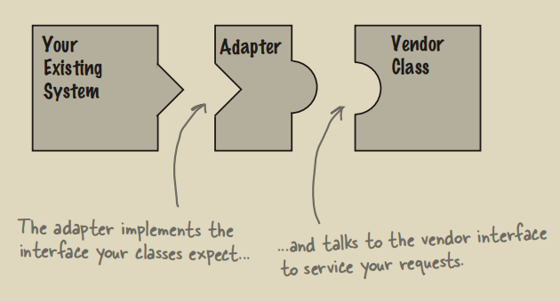
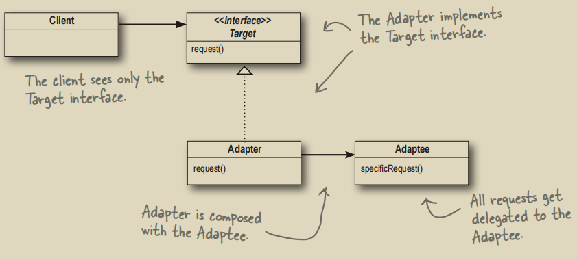

# 适配器模式

## 1. 什么是适配器模式
适配器就是将一个接口转换为另一个接口，以符合调用者的期望。有点像转换插头，让原本接口不兼容的类可以合作无间：



上图的`Your Existing Class`对应下图`Adaptee`，`Vendor Class`对应`Target`。通过`Adapter`，`Target`与`Adaptee`完全解耦：



JDK中的集合类有非常多的适配器方法（尽管不是一整个类），作用就是将某一个类转换为另一个类：
- `Arrays#asList`：将数组转换为`List`。从Java 9开始已经可以直接使用`List#of`了
- `Collections#list`：接受一个`Enumeration<T>`为参数，将`Enumeration<T>`转换为`ArrayList<T>`
- `Collections#enumeraion`：接受一个`Collection<T>`为参数，将`Collections<T>`转换为`Enumeration<T>`

可以编写一个简单的将`Enumeration<T>`（Adaptee）转换为`Iterator<T>`的类`EnumerationIterator<T>`（Adapter）：
```java
public class EnumerationIterator<E> implements Iterator<E> {
    Enumeration<E> enumeration;
    public EnumerationIterator(Enumeration<E> enumeration) {this.enumeration = enumeration;}

    @Override public boolean hasNext() {return this.enumeration.hasMoreElements();}
    @Override public E next() {return this.enumeration.nextElement();}
    @Override public void remove() {throw new UnsupportedOperationException();}
}
```
由于`Enumeration<T>`这个类是只读的，不支持修改操作，所以只能退而求其次，不支持`remove`操作。
```java
public static void main(String[] args) {
    List<String> list = List.of("apple", "banana", "cherry");
    Enumeration<String> en = Collections.enumeration(list);
    EnumerationIterator<String> adapter = new EnumerationIterator<>(en);
    
    while (adapter.hasNext()) {
        System.out.println(adapter.next());
    }
}
```
将会依次打印出`apple`、`banana`和`cherry`。

## 2. 适配器模式与装饰者模式的区别
- 适配器：将一个接口转成另一个接口
- 装饰者：不改变接口，但加入责任

## 3. Rust中的适配器模式
迭代器`Iterator` trait是Rust标准库中最能体现适配器模式的板块（与Java很像）：
- `map`：接受一个闭包`F`，把原迭代器`I`的每个`Item`映射成另一个值，返回`Map<I, F>`
- `filter`：接受一个返回`bool`的闭包`F`，只有闭包返回`true`的元素才会被保留，返回`Filter<I, P>`
- `take`：接受一个`usize`，返回`Take<I>`
> `Map`、`Filter`和`Take`都默认实现了`Sized` trait，只要是编译期能够确定大小的`struct`都默认实现了`Sized` trait。实际上`map`、`filter`和`take`方法的`self`参数都要求实现了`Sized` trait。可以视为是将`Sized`转换成了`Map`、`Filter`和`Take`。
```rust
fn main() {
    let res: Vec<_> = (1..)
        .map(|x| x * x)
        .filter(|x| x % 2 == 1)
        .take(5)
        .collect();

    println!("{:?}", res); // 前 5 个奇数平方：[1, 9, 25, 49, 81]
}
```