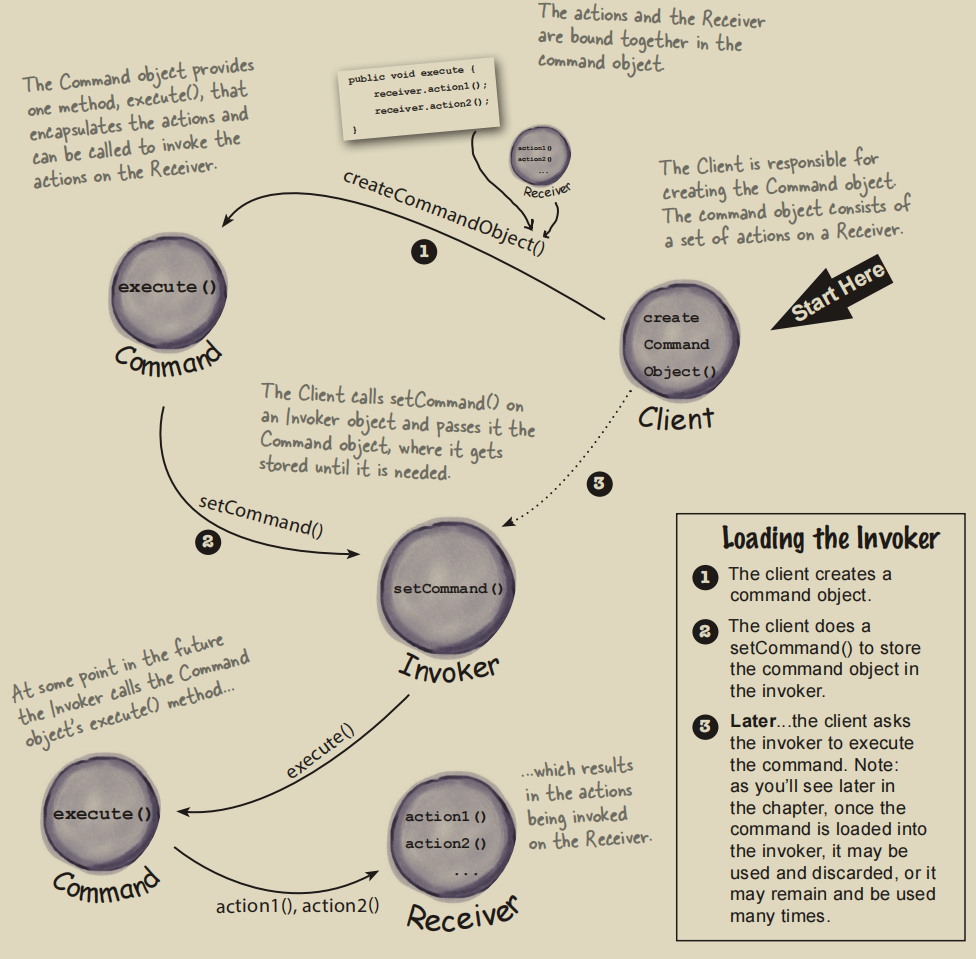
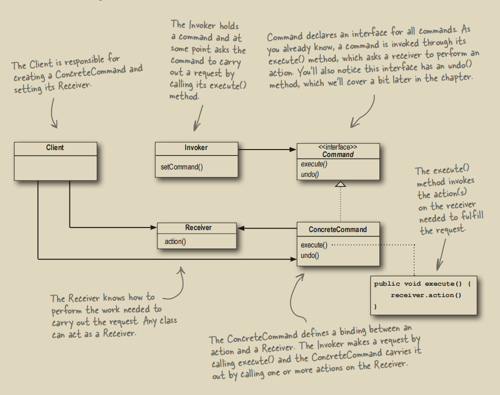

# 命令模式

## 1. Java与Rust中的命令模式
命令模式由4部分组成：
- Command：要被执行的命令
- Client：操控者
- Invoker：调用者，负责调用命令
- Receiver：真正执行命令的对象


Client创建命令并通知Invoker去调用Command，Invoker在登记Command后，具体的Command被Receiver执行。由于Client在创建Command时已经将Receiver包含进Command中，因此Command会让它的Receiver执行具体的行为。

UML图如下：


核心思想是用Command将Invoker与Receiver完全解耦。Invoker现在完全不知道Receiver的具体命令，只知道Command接口。若Client要执行命令，则他将Command对象传给Invoker。Java示例如下:
```java
// Client，这个例子中是使用遥控器的人
public class Client {
    public static void main(String[] args) {
        // Invoker
        RemoteControl remoteControl = new RemoteControl();

        // Receiver
        Light light = new Light("Living Room");
        Stereo stereo = new Stereo();

        // Command
        // 将Receiver传给Command
        LightOnCommand lightOnCommand = new LightOnCommand(light);
        LightOffCommand lightOffCommand = new LightOffCommand(light);
        StereoOnWithCDCommand stereoOnWithCDCommand = new StereoOnWithCDCommand(stereo);
        StereoOffCommand stereoOffCommand = new StereoOffCommand(stereo);
        MacroCommand partyOn = new MacroCommand(lightOnCommand, stereoOnWithCDCommand);
        MacroCommand partyOff = new MacroCommand(lightOffCommand, stereoOffCommand);

        // Invoker登记Command
        remoteControl.setCommand(0, partyOn, partyOff);

        // Invoker执行Command
        // 具体的Command会被Receiver执行
        System.out.println(remoteControl);
        System.out.println("----- Pushing Macro On Command -----");
        remoteControl.onButtonWasPushed(0);

        System.out.println("----- Pushing Macro Off Command -----");
        remoteControl.offButtonWasPushed(0);

        System.out.println("----- Undo -----");
        remoteControl.undoButtonWasPushed();
    }
}
```
```java
// Invoker，这个例子中是一个遥控器
public class RemoteControl {
    /* Fields */
    public RemoteControl() {/* Constructor */}
    
    // 登记命令
    public void setCommand(int slot, Command onCommand, Command offCommand) {}
    // 调用命令
    public void onButtonWasPushed(int slot) {this.onCommands[slot].execute();}
    // 调用命令
    public void offButtonWasPushed(int slot) {this.offCommands[slot].execute();}
    public void undoButtonWasPushed() {/* 撤销方法 */}
}
```
```java
// Command
public interface Command {
    void execute();
    void undo();
}
// ConcreteCommand
public class LightOnCommand implements Command {
    private final Light light;
    public LightOnCommand(Light light) {this.light = light;}
    @Override public void execute() {this.light.on();}
    @Override public void undo() {this.light.off();}
}
// ConcreteCommand
public class LightOffCommand implements Command {
    private final Light light;
    public LightOffCommand(Light light) {this.light = light;}
    @Override public void execute() {this.light.off();}
    @Override public void undo() {this.light.on();}
}
```
```java
// Receiver，这个例子中是家具
public class Light {
    private boolean on = false;
    private final String location;

    public Light(String location) {this.location = location;}

    public void on() {
        this.on = true;
        System.out.println(this.location + " light is on");
    }

    public void off() {
        this.on = false;
        System.out.println(this.location + " light is off");
    }
}
```
Rust中当然也可以这样完全OOP地实现命令模式（动态`trait`分发），但是借助于其强大的匹配模式，我们也能用枚举 + 匹配模式来实现命令模式。

## 2. 动态 `trait` 分发：`Box<dyn>`
使用这种方式写出来的代码跟Java十分相似。具体而言，Command接口可以使用`pub trait Command`实现，然后所有的子命令都是实现了这个`trait`的一个结构体：

```rust
// <------ Command trait ------>
pub trait Command {
    fn execute(&mut self);
    fn undo(&mut self);
    fn name(&self) -> &str;
    fn clone_box(&self) -> Box<dyn Command>;
}

// 确保生命周期不出问题
impl Clone for Box<dyn Command> {
    fn clone(&self) -> Box<dyn Command> { self.clone_box() }
}

// <------ ConcreteCommand ------>
// 里面包裹了Receiver
#[derive(Clone)]
pub struct LightOnCommand { light: Rc<RefCell<Light>> }

impl LightOnCommand {
    pub fn new(light: Rc<RefCell<Light>>) -> Self { Self { light } }
}

impl Command for LightOnCommand {
    fn execute(&mut self) { self.light.borrow_mut().on(); }
    fn undo(&mut self) { self.light.borrow_mut().off(); }
    fn name(&self) -> &str { "LightOnCommand" }
    fn clone_box(&self) -> Box<dyn Command> { Box::new(self.clone()) }
}

// <------ Receiver ------>
pub struct Light { pub on: bool, }
impl Light { /* 省略new函数、开灯与关灯方法 */ }

// <------ Invoker ------>
pub struct RemoteControl {
    history: Vec<Box<dyn Command>>,
    on_commands: Vec<Box<dyn Command>>,
    off_commands: Vec<Box<dyn Command>>,
}
impl RemoteControl { /* 省略登记命令及调用命令的方法 */}
```
这样，所有的子命令就能够通过`Box<dyn Command>`被分发，实现了不同命令的**多态**存储。这种实现方式适用于需要**撤销、命令队列及宏命令**的场景。但由于使用了`Box<dyn>`，针对生命周期的处理可能会比较麻烦。
> 提示：
> 1. 命令队列就有点像这里的例子，Invoker能够将多条Command登记到一个`Vec`中。
> 2. 宏命令是指多个子命令组成在一起的命令。例如我现在有一个`MacroCommand`：
>```java
> public class MacroCommand implements Command {
>    Command[] commands;
>
>    public MacroCommand(Command... commands) {this.commands = commands;}
>
>    @Override
>    public void execute() {
>       for (Command command : commands) {command.execute();}
>    }
>
>    @Override
>    public void undo() {
>       for (Command command : commands) {command.undo();}
>    }
> }
>```
>执行了这个`MacroCommand`就相当于一次性执行了其中所有的子命令。

## 3. 枚举 + 匹配模式
借助于Rust及其强大的匹配模式，这种方式实现的命令模式几乎是首选，因为实现起来非常简单。这种方式的实现思路与上面典型的OOP思路有所不同：
1. Command是一个枚举，其中包含所有子命令
2. 没有显式的Invoker；或者说模式匹配充当了Invoker的角色 
```rust
// Command及其ConcreteCommand
pub enum Command {
    LightOn,
    LightOff,
}

impl Command {
    // 执行时再为Command指定Receiver
    fn execute(self, receiver: &mut Light) {
        // 模式匹配相当于Invoker
        match self {
            Command::LightOn => receiver.on(),
            Command::LightOff => receiver.off(),
        }
    }
}

// Client
pub fn main() {
    let mut light = Light { on: false};
    let commands = vec![Command::LightOn, Command::LightOff];
    for cmd in commands {
        cmd.execute(&mut light);
    }
}
```
上面的Command中没有包含Receiver，我们也可以让子命令中直接包含Receiver：
```rust
// Command及Receiver
pub enum Command<'a> {
    LightOn { light: &'a mut Light },
    LightOff { light: &'a mut Light },
}

impl<'a> Command<'a> {
    fn execute(self) {
        // 模式匹配相当于Invoker
        match self {
            Command::LightOn{ light } => light.on(),
            Command::LightOff{ light } => light.off(),
        }
    }
}

// Client
pub fn main() {
    let mut light = Light { on: false};
    {
        let cmd1 = Command::LightOn  { light: &mut light };
        cmd1.execute();  // 执行完就把 &mut light 还回去
    }
    {
        let cmd2 = Command::LightOff { light: &mut light };
        cmd2.execute();
    }
}
```
更推荐第一种方式，因为不涉及生命周期的问题。