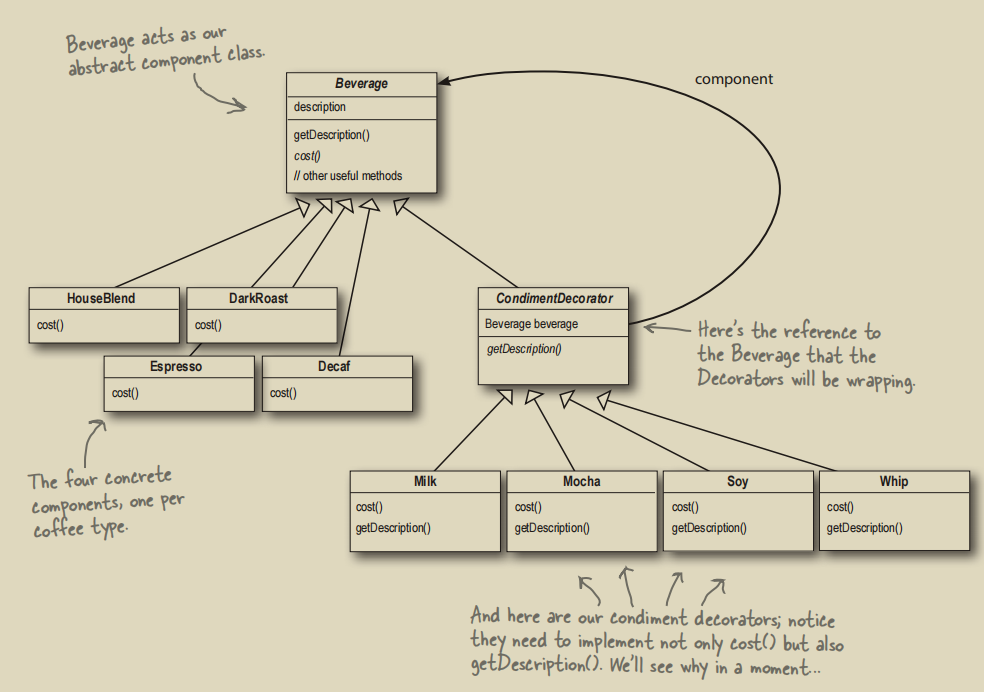
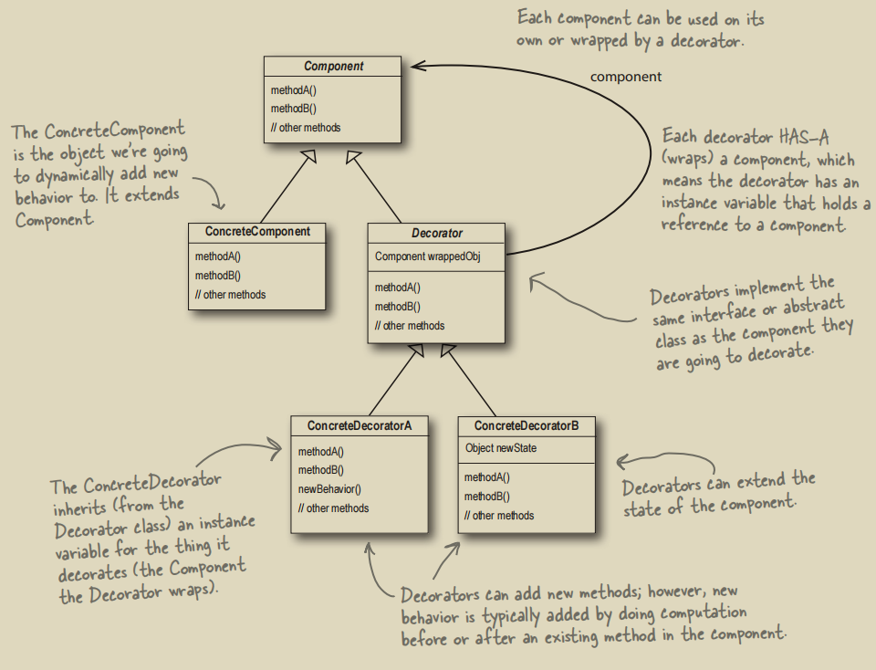
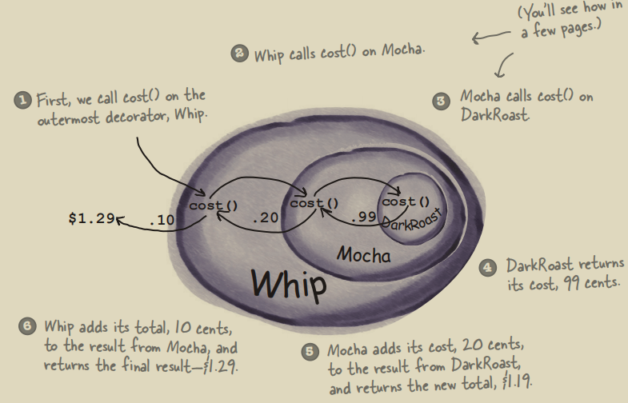
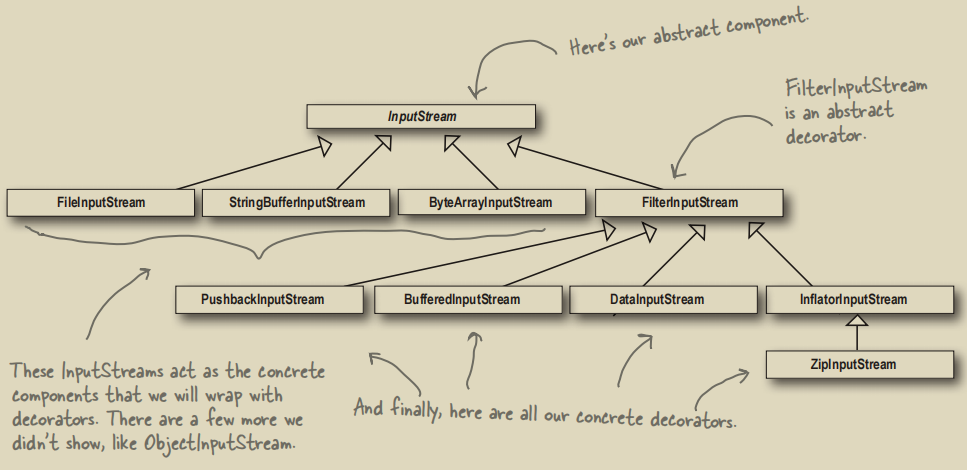

# 装饰者模式

## 1. 为什么要使用装饰者模式

装饰者模式常用于解决组合数目爆炸问题。具体来说：



`Beverage`作为一个顶级接口或者抽象类，假设我们所有的组合都“机械地“去继承`Beverage`，那么要创建的子类会多到爆炸。但如果将`Beverage`拆开成两种：一种是真正的本体饮料，一种是配料，让配料加在饮料上，这样就能达到类复用的效果。而且如果未来要增加新的饮料或者配料，原有的类也不需要进行改动。这符合“**面向扩展开放，面向修改关闭**”的设计思想。



以下为饮料例子的实现：

```java
public abstract class Beverage {
    Size size = Size.TALL;
    String description = "Unknown Beverage";

    public String getDescription() {return this.description;}
    public void setSize(Size size) {this.size = size;}
    public Size getSize() {return size;}
    public abstract double cost();

    public enum Size {TALL, GRANDE, VENTI}
}

// 被装饰者
public class Espresso extends Beverage {
    public Espresso() {this.description = "Espresso";}

    @Override
    public double cost() {return 1.99;}
}

// 装饰者抽象类，所有具体的装饰者将继承这个类
public abstract class Condiment extends Beverage {
    // 被装饰（包裹）对象
    Beverage beverage;

    public abstract String getDescription();
}

// 具体的装饰者
public class Mocha extends Condiment {
    public Mocha(Beverage beverage) {this.beverage = beverage;}

    @Override
    public String getDescription() {
        return this.beverage.getDescription() + ", Mocha";
    }

    @Override
    public double cost() {
        // 这个 + 0.20 即为“装饰”
        return switch (this.beverage.getSize()) {
            case VENTI -> this.beverage.cost() + 0.20;
            case GRANDE -> this.beverage.cost() + 0.40;
            case TALL -> this.beverage.cost() + 0.60;
        };
    }
}
```

`cost`方法的执行顺序如下：



有点像递归：层层传入再层层返回。

## 2. JDK中的装饰者模式

JDK中不乏装饰者模式的例子，例如`java.io`中的`InputStream`：



- `InputStream`为顶级抽象类
- `FileInputStream`, `StringBufferInputStream`, `ByteArrayInputStream`都是被装饰对象
- `FilterInputStream`是抽象装饰对象，所有具体的装饰对象都要继承它
- `PushbackInputStream`, `BufferedInputStream`, `DataInputStream`, `InflatorInputStream`包括`ZipInputStream`都是具体装饰对象

基于此，我们可以自己创建一个装饰者对象`LowerCaseInputStream`来包装`InputStream`，使得文本的输出字符都是小写字母：
```java
public class LowerCaseInputStream extends FilterInputStream {
    public LowerCaseInputStream(InputStream in) {super(in);}

    @Override
    public int read() throws IOException {
        int c = in.read();
        return c == -1 ? c : Character.toLowerCase((char) c);
    }

    @Override
    public int read(byte[] b, int offset, int len) throws IOException {
        int result = in.read(b, offset, len);
        for (int i = offset; i < offset + result; i++) {
            b[i] = (byte) Character.toLowerCase((char) b[i]);
        }
        return result;
    }
}

public class InputTest {
    // 该文本文件中只有一句话：I know the Decorator Pattern therefore I RULE!
    private static final String TEST_FILE = "OOPDesign/src/main/java/decorator/io/test.txt";

    public static void main(String[] args) throws FileNotFoundException {
        int c;
        try {
            // 典型的装饰者模式，层层包裹
            InputStream in =
                    new LowerCaseInputStream(
                            new BufferedInputStream(
                                    new FileInputStream(TEST_FILE)));
            while ((c = in.read()) >= 0) {
                System.out.print((char) c);
            }
        } catch (IOException e) {
            throw new RuntimeException(e);
        }
    }
}
```

## 3. Rust中的装饰者模式
对于`Beverage`这种顶级接口，Rust中可以使用`trait`。然后装饰者（配料）在内部存储一个满足`Beverage`的泛型即可：
```rust
// --------------------------------
// 顶级接口
// --------------------------------
#[derive(Clone, Copy)]
pub enum Size { Tall, Grande, Venti }

pub trait Beverage {
    fn get_description(&self) -> String;
    fn set_size(&mut self, size: Size);
    fn get_size(&self) -> Size;
    fn cost(&self) -> f64;
}

// --------------------------------
// 被装饰者
// --------------------------------
pub struct DarkRoast { size: Size, }

impl DarkRoast {
    pub fn new(size: Size) -> DarkRoast { DarkRoast { size } }
}

impl Beverage for DarkRoast {
    fn get_description(&self) -> String { "Dark Roast".to_string() }
    fn set_size(&mut self, size: Size) { self.size = size; }
    fn get_size(&self) -> Size { self.size.clone() }
    fn cost(&self) -> f64 { 0.99 }
}

// --------------------------------
// 装饰者：携带一个泛型
// --------------------------------
pub struct Mocha<B: Beverage> { beverage: B, }

impl<B: Beverage> Mocha<B> {
    pub fn new(beverage: B) -> Self { Mocha { beverage } }
}
```
当然也可以使用`Box<dyn Beverage>`，但动态分发不具有泛型的零成本抽象优势。

Rust中关于输入流的组件也是典型的装饰者模式：
- `Read` trait：顶级`trait`
- `Cursor`：被装饰对象
- `BufReader`：装饰者

```rust
fn main() {
    let mut buf = [0u8; 10];
    // BufReader为装饰者
    let mut input = BufReader::new(Cursor::new("input data"));

    input.read(&mut buf).ok();
    print!("Read from a buffered reader: ");

    for byte in buf {
        print!("{}", char::from(byte));
    }
}
```