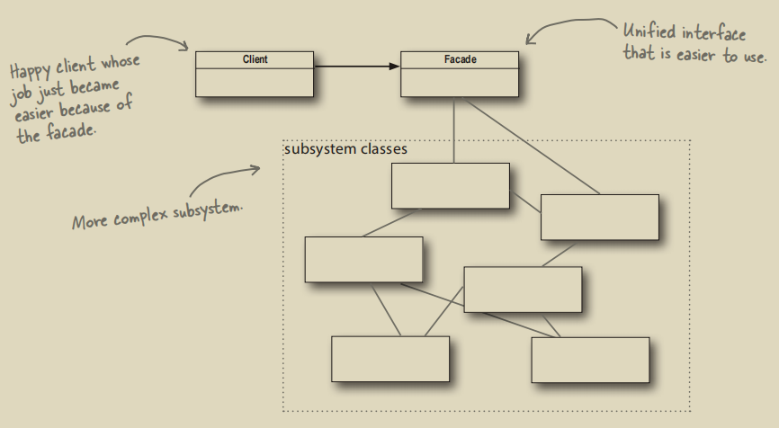

# 外观模式

## 1. 外观模式的作用



外观模式通过提供一个更合理（简洁）的接口，使得一个复杂的子系统变得容易调用。有点像SpringBoot中的`run`方法：我们无需关注Spring框架中的每个模块有多么复杂，只需要一个`run`就能让一切运行起来。
> 注意：`run`方法不完全是外观模式，因为`run`方法除了包装还同时负责：
> 1. 决定上下文类型
> 2. 解析命令行参数
> 3. 处理 Spring Boot 特定的自动化配置

## 2. 外观模式与适配器模式的不同

两种模式的差异不在于它们包装了多少类，而是在于它们的意图：
* 适配器模式：**改变**接口，符合用户的期望
* 外观模式：提供子系统的一个**简化接口**

## 3. JDK中的外观模式
一个典型的例子是`java.sql.DriverManager`。客户端只需要调用统一入口：

```java
Connection conn = DriverManager.getConnection(url, user, password);
```
就可以获得JDBC连接，而无需关心底层到底是哪家数据库驱动、如何加载驱动类、如何初始化连接等细节。

## 4. Rust标准库中的外观模式
在Rust的标准库里，一个很好的外观模式例子是`std::fs::read_to_string`：
```rust
let contents: String = fs::read_to_string("config.toml")?;
```
只需这一行就能读取整个文件为`String`。其内部封装了如下步骤：
1. 打开文件
2. 分配缓冲区
3. 循环读取
4. 转为`String`
5. 关闭文件