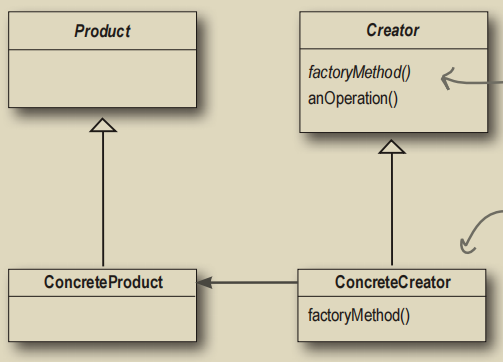
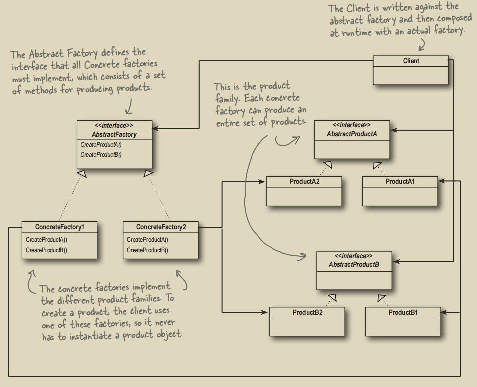

# 工厂模式

## 1. 工厂方法模式
使用工厂模式能够封装创建实例的细节，使得创建实例时，不需要频繁地进行条件判断并`new`对象。

`PizzaStore`（创建类）需要创建`Pizza`（产品类）。如果直接将`new`对象的逻辑放在`PizzaStore`中，那么以后如果还有需要获取`Pizza`的类（例如`PizzaShopMenu`），则需要将这部分逻辑再写一遍。不仅造成了代码的冗余，改起来也麻烦且容易出错。

对此，可以考虑使用`Factory`类（工厂类）进行封装。
```java
public class SimplePizzaFactory {
    public Pizza createPizza(String type) {
        return switch (type) {
            case "cheese" -> new CheesePizza();
            case "pepperoni" -> new PepperoniPizza();
            default -> throw new NoSuchPizzaException("No such pizza.");
        };
    }
}
```

工厂模式实现的方式有3种：
1. 建立一个`Factory`类
2. 静态工厂：使用一个静态方法来代替`Factory`类
3. **工厂方法模式**：单纯的`create`方法

第二种严格来说不是工厂模式。由于静态工厂是独属于一个类的，在可扩展性上不如`Factory`类强，因此第一、三种方式更为推荐。第三种方式更灵活，且不需要创建工厂类。

对于第一种方式，直接将工厂类组合进入创建类：
```java
public class PizzaStore {
    // PizzaStore组合了Pizza工厂类
    SimplePizzaFactory factory;

    public PizzaStore(SimplePizzaFactory factory) {this.factory = factory;}

    public Pizza orderPizza(String type) {
        Pizza pizza = this.factory.createPizza(type);
        
        pizza.prepare();
        pizza.bake();
        pizza.cut();
        pizza.box();
        return pizza;
    }
}
```

如果使用第三种方法（**工厂方法模式**），则创建类是一个抽象类，将来会有很多子类进行**具体的工厂方法**实现。



```java
// 创建类
public abstract class PizzaStore {
    // 防止重写
    public final Pizza orderPizza(String type) {
        Pizza pizza = createPizza(type);

        pizza.prepare();
        pizza.bake();
        pizza.cut();
        pizza.box();
        return pizza;
    }

    // 工厂方法
    public abstract Pizza createPizza(String type);
}

// 一个具体的PizzaStore，拥有自己独特的创建Pizza的方式
public class NYPizzaStore extends PizzaStore {
    @Override
    public Pizza createPizza(String type) {
        return switch (type) {
            case "cheese" -> new NYStyleCheesePizza();
            case "pepperoni" -> new NYStylePepperoniPizza();
            default -> null;
        };
    }
}
```

## 2. 依赖倒置原则（SOLID中的D）
当`PizzaStore`在创建`Pizza`时，`PizzaStore`并没有一个个去`new`具体的子类（依赖子类），而是直接创建了一个抽象的`Pizza`，并将实例化推迟到`NYPizzaStore`中创建。这体现了**依赖倒置原则**。

为了避免违反依赖倒置原则，应当尽量做到：
1. 变量不可以持有具体类的引用 \
如果使用`new`，就会持有具体类的引用。此时可以改用工厂来避开这样的做法。
2. 不要让类派生自具体类 \
如果派生自具体类，就会依赖具体类。应当派生自一个抽象（接口/抽象类）。
3. 不要覆盖基类中已实现的方法 \
基类中已实现的方法（`PizzaStore#orderPizza`）应当为所有子类共享且不可修改（`final`）。

## 3. 抽象工厂模式
简单来说，就是不仅将创建具体类交付给工厂，而且推迟到具体工厂。抽象工厂定义了一个负责创建一组产品的接口，接口内每个方法都负责创建一个具体产品。

下图中，`Client`通过创建具体工厂，从而创建具体的产品：



假设我们要创建拥有不同配料的`Pizza`，此时`Pizza`是创建类，各种toppings是产品类：
```java
public abstract class Pizza {
    // 以下都是产品类
    Dough dough;
    Sauce sauce;
    Veggies[] veggies;
    Cheese cheese;
    Pepperoni pepperoni;
    Clam clam;
    /* 省略所有方法 */
}

public class ClamPizza extends Pizza {
    PizzaIngredientFactory ingredientFactory;
    public ClamPizza(PizzaIngredientFactory ingredientFactory) {this.ingredientFactory = ingredientFactory;}
}
```
`Dough`等原料类都是接口，下面有具体的实现类。`NYPizza`和`ChicagoPizza`的创建则依赖这些具体的toppings实现类，分别由`NYPizzaIngredientFactory`和`ChicagoPizzaIngredientFactory`创建：

```java
// 抽象工厂
public interface PizzaIngredientFactory {
    Dough createDough();
    Sauce createSauce();
    Cheese createCheese();
    Veggies[] createVeggies();
    Pepperoni createPepperoni();
    Clam createClam();
}

// 两个具体工厂，每个方法都创建了一个产品
public class NYPizzaIngredientFactory implements PizzaIngredientFactory {
    @Override public Dough createDough() {return new ThinCrustDough();}
    @Override public Sauce createSauce() {return new MarinaraSauce();}
    @Override public Cheese createCheese() {return new ReggianoCheese();}
    @Override public Veggies[] createVeggies() {return new Veggies[]{new Garlic(), new Onion(), new Mushroom(), new RedPepper()};}
    @Override public Pepperoni createPepperoni() {return new SlicedPepperoni();}
    @Override public Clam createClam() {return new FreshClam();}
}

public class ChicagoPizzaIngredientFactory implements PizzaIngredientFactory {
    @Override public Dough createDough() {return new ThickCrustDough();}
    @Override public Sauce createSauce() {return new PlumTomatoSauce();}
    @Override public Cheese createCheese() {return new MozzarellaCheese();}
    @Override public Veggies[] createVeggies() {return new Veggies[]{new Spinach(), new Eggplant(), new BlackOlives()};}
    @Override public Pepperoni createPepperoni() {return new SlicedPepperoni();}
    @Override public Clam createClam() {return new FrozenClam();}
}
```

那么顶级调用者（`Client`，或者说`PizzaStore`）只要创建具体工厂就能创建出具体类型的`Pizza`:
```java
public class NYPizzaStore extends PizzaStore {
    @Override
    public Pizza createPizza(String type) {
        PizzaIngredientFactory ingredientFactory = new NYPizzaIngredientFactory();
        return switch (type) {
            case "cheese" -> new CheesePizza(ingredientFactory);
            case "pepperoni" -> new PepperoniPizza(ingredientFactory);
            case "clam" -> new ClamPizza(ingredientFactory);
            default -> null;
        };
    }
}
```

## 4. Rust中的“工厂模式”
Rust中的工厂模式是不必要的（甚至可能成为一种反模式），通常直接使用关联函数`new`或者其他特殊的函数就能够创建一个或多个具体对象。这称为“天然的”工厂模式。

例如`mspc:channel()`就天然地是一种工厂方法：

```rust
let (tx, rx) = mspc::channel();
```
这个方法创建了两个对象：`tx: Sender<T>`和`rx: Receiver<T>`。

`fs::OpenOptions`不仅是天然的工厂方法，还是`Builder`模式：
```rust
let mut file = OpenOptions::new()
        .create(true)
        .append(true)
        .open(path)
        .expect("Cannot open log file!");
```
后面的链式调用就是`Builder`模式的体现。
