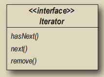
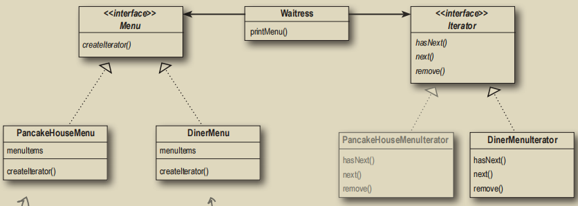
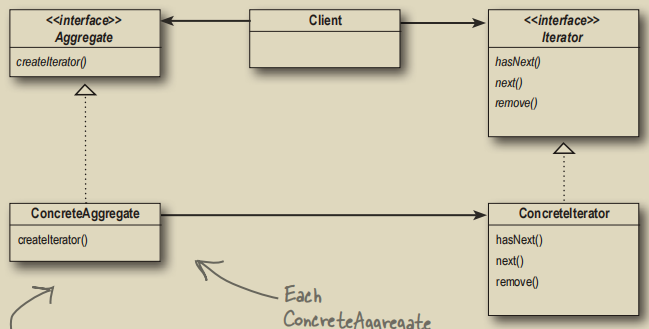

# 迭代器模式

迭代器模式提供一种方法顺序访问一个聚合对象中的各个元素，而又不暴露其内部的表示。最关键的接口是`java.util.Iterator<E>`：



其中最重要的方法是`hasNext`与`next`，用于遍历元素。

假设现在有两个类，一个类使用数组作为集合，另一个类使用`ArrayList`作为集合。在不使用迭代器模式之前，想要遍历这两个类，就必须分别为这两个类实现遍历的方法：

```java
@Getter
public class PancakeHouseMenu {
    ArrayList<MenuItem> menuItems;
}

@Getter
public class DinerMenu {
    static final int MAX_ITEMS = 6;
    int numberOfItems = 0;
    MenuItem[] menuItems;
}
```
但作为集合，遍历在逻辑上是一致的：判断下一个元素是否存在并取出下一个元素，所以完全没有必要为两个集合都实现一遍循环。其次，如果集合的种类变多，那么实现循环的次数也会变多，造成代码冗余。

解决这个问题最好的方法就是使用`Iterator<E>`，然后针对每个具体类进行`next`和`hasNext`的方法的重写：
```java
public class DinerMenuIterator implements Iterator<MenuItem> {
    MenuItem[] items;
    int position = 0;

    public DinerMenuIterator(MenuItem[] items) {this.items = items;}

    @Override public MenuItem next() {return items[position++];}
    @Override public boolean hasNext() {return position < items.length && items[position] != null;}
}
```
```java
public class PancakeHouseMenuIterator implements Iterator<MenuItem> {
    ArrayList<MenuItem> menuItems;
    int position = 0;

    public PancakeHouseMenuIterator(ArrayList<MenuItem> menuItems) {this.menuItems = menuItems;}

    @Override public boolean hasNext() {return position < menuItems.size();}
    @Override public MenuItem next() {return menuItems.get(position++);}
}
```
之后，若要对原来的类进行遍历，直接使用这个迭代器即可：
```java
@Getter
public class PancakeHouseMenu implements Menu {
    ArrayList<MenuItem> menuItems;
    
    public PancakeHouseMenu() {/* 省略构造方法 */}

    // 这个工厂方法返回一个迭代器
    @Override public Iterator<MenuItem> createIterator() {
        return new PancakeHouseMenuIterator(menuItems);
    }
}
```
```java
@AllArgsConstructor
public class Client {
    Menu pancakeHouseMenu;
    Menu dinerMenu;

    public void printMenu() {
        Iterator<MenuItem> pancakeHouseMenuIterator = pancakeHouseMenu.createIterator();
        Iterator<MenuItem> dinerMenuIterator = dinerMenu.createIterator();

        System.out.println("MENU\n----\nBREAKFAST");
        printMenu(pancakeHouseMenuIterator);
        System.out.println("\nLUNCH");
        printMenu(dinerMenuIterator);
    }

    private void printMenu(Iterator<MenuItem> iterator) {
        while (iterator.hasNext()) {
            MenuItem menuItem = iterator.next();
            System.out.println(menuItem.getName() + ", ");
            System.out.println(menuItem.getPrice() + ", ");
            System.out.println(menuItem.getDescription());
        }
    }
}
```

我们可以从上面的过程抽象出迭代器模式的模型：



进一步地：



上面的例子中，`Menu`就是`Aggragate`（聚合接口）。
