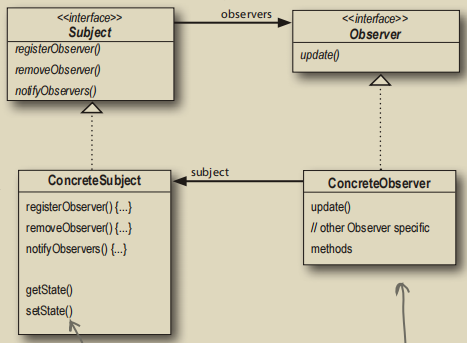

# 观察者模式

非常简单的一种行为模式。


不做过多解释，直接看Java是如何实现的：
```java
public interface Subject {
    void registerObserver(Observer o); // 注册订阅者
    void removeObserver(Observer o); // 移除订阅者
    void notifyObservers(); // 广播消息
}

public interface Observer {
    void update(); // 订阅者接受消息并修改自身状态
}
```
主题的具体对象通只要实现`Subject`接口、指定需要广播的字段并维护一个订阅对象的列表即可：
```java
public class WeatherData implements Subject {
    private final ArrayList<Observer> observers;
    private float temperature;
    private float humidity;
    private float pressure;

    public WeatherData() {this.observers = new ArrayList<>();}
}
```
在Rust中，虽然也可以使用`trait`来实现相似的设计模式，但是生命周期存在很大的问题：订阅者和主题谁应该存活得更久？为了避免这个问题，通常直接使用`std`库或者`tokio`中的`mpsc::channel`或者`broadcast::channel`，这样不仅能够天然地实现订阅机制，还能够确保线程之间的安全性，在高并发条件下也能确保线程安全。

`mpsc::channel`与`broadcast::channel`有一点区别：
- `mpsc::channel`是一对一模型
- `broadcast:channel`是一对多模型，适合一生产者多消费者的情景

在下面的代码中，`tx`为主题，`rx_a`和`rx_b`为订阅了`tx`的两个订阅者：
```rust
#[tokio::main]
async fn main() {
    let (tx, _rx) = broadcast::channel::<String>(16);
    
    let mut rx_a = tx.subscribe();
    tokio::spawn(async move {
        let string = rx_a.recv().await.unwrap();
        println!("{}", string);
    });
    
    let mut rx_b = tx.subscribe();
    tokio::spawn(async move {
        let string = rx_b.recv().await.unwrap();
        println!("{}", string);
    });
}
```
若要更加清晰的订阅者结构，可以考虑使用`enum`进行列举。