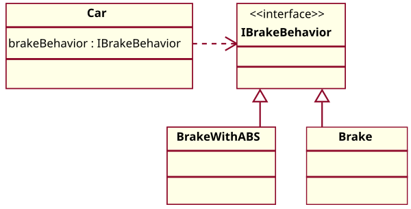
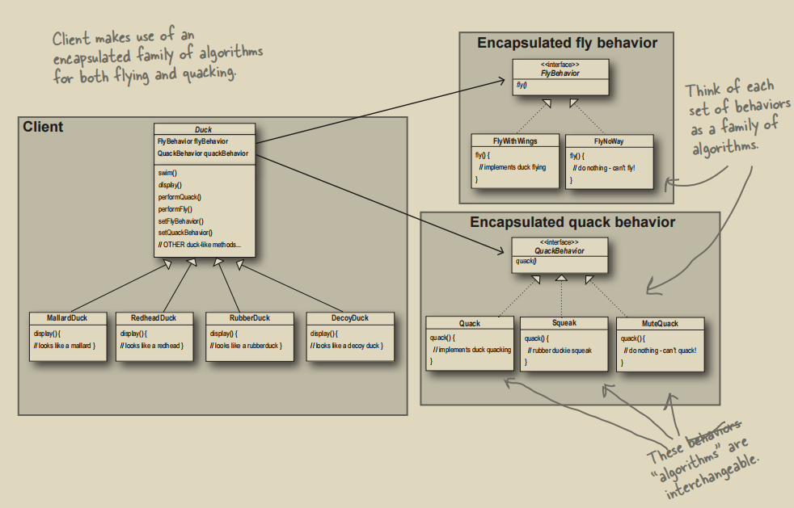

# 策略模式

## 1. Java与Rust中的策略模式

Rust中的策略模式与Java中不同。由于Java是传统OOP语言，其实现策略模式需要绕很多弯。常见的Java中的策略模式UML图为：



```java
public abstract class Duck {
    QuackBehavior quackBehavior;
    FlyBehavior flyBehavior;

    public Duck() {}

    public abstract void display();

    public void performQuack() {
        this.quackBehavior.quack();
    }

    public void performFly() {
        this.flyBehavior.fly();
    }

    public void swim() {
        System.out.println("All ducks can swim.");
    }
}
```
一个抽象类`Duck`组合了两个接口`FlyBehavior` & `QuackBehavior`，具体的接口实现（`fly` & `quack`）将**委托**给实现了接口的子类。

但Rust有`trait`特性，天然就能够实现策略模式。一般来说有两种方法能够实现策略模式：
1. 静态分发（委托）：泛型
2. 动态分发（委托）：`Box<dyn>`

## 2. `trait` + 结构体组合实现策略模式
以下是一个`Duck`的策略模式的Java实现UML图。在Java中，两个可变行为被抽成两个接口，而剩下的不变的部分是一个抽象类`Duck`。该抽象类以接口的形式组合了两个可变行为（面向接口编程），将具体的可变行为**委托**给实现了接口的具体类。


在Rust中，接口就好似`trait`，其他所有需要实现这个`trait`的实现类可以当成是一个单元结构体：
```rust
pub trait FlyBehavior {
    fn fly(&self);
}

pub struct FlyWithWings;
impl FlyBehavior for FlyWithWings {
    fn fly(&self) {
        println!("I'm flying with wings.");
    }
}

pub struct FlyWithRocket;
impl FlyBehavior for FlyWithRocket {
    fn fly(&self) {
        println!("I'm flying with rocket.");
    }
}

pub struct FlyNoWay;
impl FlyBehavior for FlyNoWay {
    fn fly(&self) {
        println!("I can't fly.");
    }
}
```
这样，`Duck`结构体就能够组合这两种可变行为了。

## 3. 静态委托：泛型
可以将两个可变行为描述成实现了各自`trait`的泛型：
```rust
pub struct DuckWithGenerics<Q: QuackBehavior, F: FlyBehavior> {
    pub quack_behavior: Q,
    pub fly_behavior: F,
}

impl<Q, F> DuckWithGenerics<Q, F>
where
    Q: QuackBehavior,
    F: FlyBehavior
{
    pub fn new(quack: Q, fly: F) -> Self {
        DuckWithGenerics {
            quack_behavior: quack,
            fly_behavior: fly,
        }
    }

    pub fn perform_quack(&self) {
        self.quack_behavior.quack();
    }

    pub fn perform_fly(&self) {
        self.fly_behavior.fly();
    }
}
```
好处是静态分发，零成本抽象，编译器能够做更多优化。缺点是**类型爆炸**，`Duck<Q, F>`用泛型参数把每一种行为组合都当成一个新类型，这样就没有办法把不同组合的`Duck`放到同一个`Vec`中，也没有办法在运行时自由切换实现。

## 4. 动态分发：`Box<dyn>`
解决**类型爆炸**的方法就是使用`trait`对象：
```rust
pub struct Duck {
    quack_behavior: Box<dyn QuackBehavior>,
    fly_behavior: Box<dyn FlyBehavior>,
}

impl Duck {
    pub fn new(
        quack: Box<dyn QuackBehavior>, 
        fly: Box<dyn FlyBehavior>) -> Self {
        Self { quack_behavior: quack, fly_behavior: fly }
    }
    
    pub fn perform_quack(&self) { self.quack_behavior.quack(); }
    pub fn perform_fly(&self) { self.fly_behavior.fly(); }
    
    // 关键：可以在“运行时”做出改变
    pub fn set_fly_behavior(&mut self, fly: Box<dyn FlyBehavior>) { self.fly_behavior = fly; }
    pub fn set_quack_behavior(&mut self, quack: Box<dyn QuackBehavior>) { self.quack_behavior = quack; }
}
```
这样创建出来的所有`Duck`都是同一个类型的，所以下面的代码是合法的：
```rust
let mut ducks = vec![];
let rubber_duck = Duck::new(Box::new(Squeak), Box::new(FlyNoWay));
let duck_call = Duck::new(Box::new(Quack), Box::new(FlyNoWay));
let red_head_duck = Duck::new(Box::new(Quack), Box::new(FlyWithWings));
let rocket_duck = Duck::new(Box::new(Quack), Box::new(FlyWithRocket));
ducks.push(rubber_duck);
ducks.push(duck_call);
ducks.push(red_head_duck);
ducks.push(rocket_duck);
for duck in ducks {
    duck.perform_fly();
    duck.perform_quack();
}
```
也可以改变`Duck`的行为：
```rust
let mut mallard_duck = Duck::new(Box::new(Quack), Box::new(FlyWithWings));
mallard_duck.set_quack_behavior(Box::new(Squeak));
```

## 5. 什么时候还用泛型
1. **不需要**在运行时做任何切换、只想要**最高性能**（编译时就确定好行为）
2. 且**行为组合总数可控**、不会爆炸到几百种