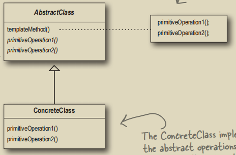

# 模板方法模式

## 1. 模板方法的定义
模板方法定义了一个算法的步骤，并允许子类为一个或多个步骤提供实现（将一些步骤延迟到子类中）。这样使得子类可以在不改变算法结构的情况下，重新定义算法中的某些步骤。



例如现在有一个“泡咖啡因饮料”的方法`prepareRecipe`：
```java
public abstract class CaffeineBeverage {
    final void prepareRecipe(){
        boilWater();
        brew();
        pourInCup();
        addCondiments();
    }
}
```

将来要继承`CaffeineBeverage`的两个类`Tea`和`Coffee`虽然在具体步骤的实现上有一些不同，但步骤却完全遵循`prepareRecipe`这个**模板方法**：
```java
public class Tea extends CaffeineBeverage{
    @Override
    public void addCondiments() {
        System.out.println("Adding lemon");
    }

    @Override
    public void brew() {
        System.out.println("Steeping the tea");
    }
}
```
这样，子类就完成了对一个或多个步骤的具体实现。

## 2. 钩子方法
将上面的`CaffeineBeverage`类抽象出来一个模型：
```java
abstract class AbstractClass {
    final void templateMethod() {
        primitiveOperation1();
        primitiveOperation2();
        concreteOperation();
        hook();
    }
    
    abstract void primitiveOperation1();
    abstract void primitiveOperation2();
    
    final void concreteOperation() {
        /* 具体实现 */
    }
    
    // 钩子方法，但它什么事情都不做
    // 子类可以视情况决定要不要重写
    void hook() {}
}
```
钩子方法是一种被声明在抽象类中的方法，但只有空的或者默认的实现。它的存在，可以让子类有能力对算法的不同点进行挂钩。
```java
public abstract class CaffeineBeverageWithHook {
    // 模板方法
    final void prepareRecipe(){
        boilWater();
        brew();
        pourInCup();
        if (customerWantsCondiments()) {addCondiments();}
    }

    // 应当被改写的方法
    abstract void addCondiments();
    abstract void brew();

    void boilWater(){System.out.println("Boil water");}
    void pourInCup(){System.out.println("Pour in cup");}
    
    // 钩子，返回true是默认实现
    // 子类可以根据需要（不）改写这个钩子
    boolean customerWantsCondiments(){return true;}
}
```
```java
public class CoffeeWithHook extends CaffeineBeverageWithHook {
    @Override
    public void brew() {
        System.out.println("Dripping coffee thru filter");
    }

    @Override
    public void addCondiments() {
        System.out.println("Adding sugar and milk");
    }
    
    @Override
    public boolean customerWantsCondiments() {
        String answer = getUserInput();
        return answer.toLowerCase().startsWith("y");
    }
    
    private String getUserInput() {
        String answer = null;
        System.out.println("Would you like milk and sugar with your coffee (y/n)? ");
        
        BufferedReader in = new BufferedReader(new InputStreamReader(System.in));
        try {
            answer = in.readLine();
        } catch (IOException ex) {
            System.err.println(ex.getMessage());
        }
        
        if (answer == null) return "no";
        
        return answer;
    }
}
```
可以看到，通过钩子，我们能够让用户灵活选择是否加入配料，从而选择性调用`addCondiments`这个方法。

## 3. JDK中的模板方法模式
### 3.1. `java.util.concurrent.ThreadPoolExecutor`
`ThreadPoolExecutor#runWorker`是一个典型的模板方法，其签名被`final`修饰：
```java
final void runWorker(Worker w) {
    Thread wt = Thread.currentThread();
    Runnable task = w.firstTask;
    w.firstTask = null;
    w.unlock();
    boolean completedAbruptly = true;
    try {
        while (task != null || (task = getTask()) != null) {
            w.lock();
            if ((runStateAtLeast(ctl.get(), STOP) ||
                 (Thread.interrupted() &&
                  runStateAtLeast(ctl.get(), STOP))) &&
                !wt.isInterrupted())
                wt.interrupt();
            try {
                // primitiveOperation1
                beforeExecute(wt, task);
                try {
                    task.run();
                    // primitiveOperation2
                    afterExecute(task, null);
                } catch (Throwable ex) {
                    afterExecute(task, ex);
                    throw ex;
                }
            } finally {
                task = null;
                w.completedTasks++;
                w.unlock();
            }
        }
        completedAbruptly = false;
    } finally {
        processWorkerExit(w, completedAbruptly);
    }
}
```
这里有两个原始方法：
1. `beforeExecute`
2. `afterExecute`
这两个方法都没有被实现，需要被具体的子类重写才能发挥具体作用。

### 3.2. `java.util.AbstractList`等集合类
`AbstractList.SubList`内部类依赖于抽象方法`get`、`size`和`set`的具体实现，因为`AbstractList`中的这三个方法不是抽象方法就是没有任何实质性作用。

如果我们要实现自己的List，那么我们需要重写这些方法，让这些方法有具体功能：
```java
public class MyStringList extends AbstractList<String> {
    private final String[] myList;
    
    public MyStringList(String[] myList) {this.myList = myList;}
    
    @Override public String get(int index) {return this.myList[index];}
    @Override public int size() {return this.myList.length;}
    @Override public String set(int index, String elem) {
        String oldString = this.myList[index];
        this.myList[index] = elem;
        return oldString;
    }
}
```

### 3.3. `jakarta.servlet.http.HttpServlet`
所有的`do`开头的方法都是未被具体实现的原始方法，例如`doGet`。

## 4. Rust中的模板方法模式
Rust中使用到模板方法模式最经典的例子仍然是`Iterator` trait：
```rust
pub trait Iterator {
    type Item;

    // 必须实现的方法 (抽象步骤)
    fn next(&mut self) -> Option<Self::Item>;

    // 模板方法 (有默认实现)
    fn count(self) -> usize {
        let mut count = 0;
        while let Some(_) = self.next() { // 调用next()
            count += 1;
        }
        count
    }

    // 另一个模板方法
    fn map<B, F>(self, f: F) -> Map<Self, F>
    where
        Self: Sized,
        F: FnMut(Self::Item) -> B,
    {
        Map::new(self, f)
    }
}
```
`next`作为一个空方法，需要被实现了`Iterator` trait的结构体具体实现，然后就能自动获得`count`、`map`等方法了。
